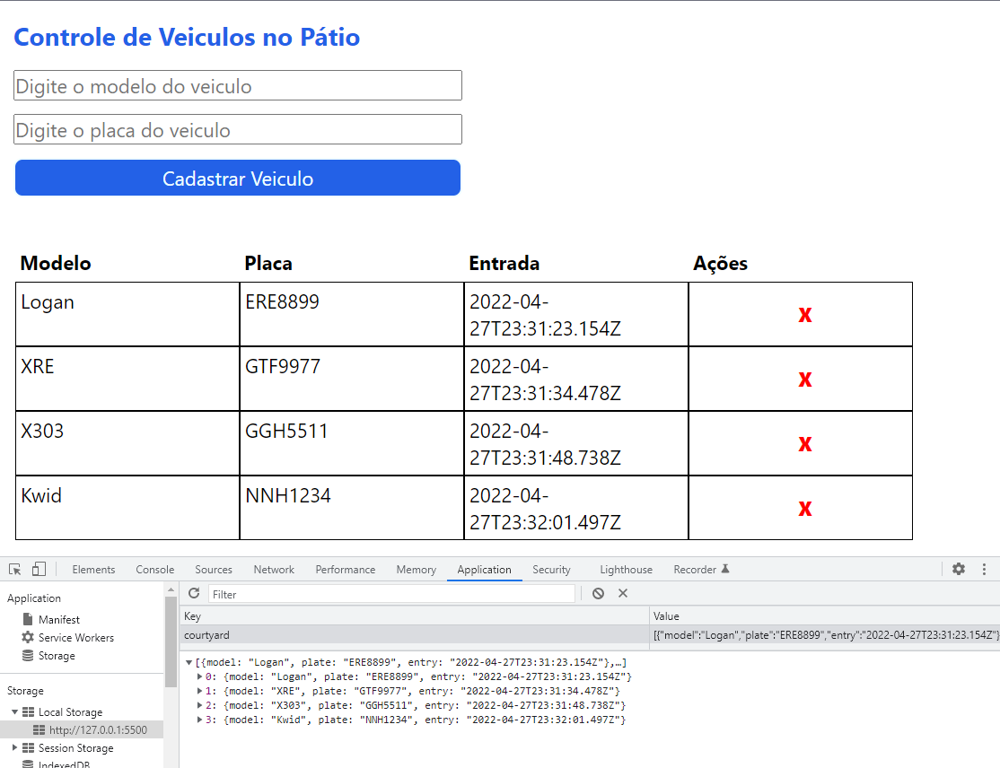

## Projeto de um sistema de estacionamento usando typescript.

**Projeto feito passo a passo**

- Typescript conceito bem entendido, mas muito codigo novo e formatação nova que não foi bem assimilada.
- adicione novos tipos e modifiquei nomes de variaveis e classes para entender os erros e avisos que o typescript informava.

**Criação Personalizada**

- CSS do projeot feito simples, mas para dar uma visualização melhor

**Falha**

- Botão de excluir não funcionou, apesar do cod estar ok, voltar ao projeto no futuro pra tentar corrigir.
