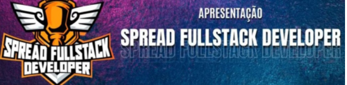

## Bootcamp Spread Fullstack Developer

**Modulo 01** - Conteudo Inicial

:white_check_mark:- Boa Vindas

:white_check_mark:- Mentoria 01 - 20/04

:white_check_mark:- Logica de Programação

:white_check_mark:- Git e GitHub - Introdução

:white_check_mark:- Desafio, Criando Primeiro Repositório (https://github.com/Thander21/00-CSS-Projeto-Flexbox--DIO)

**Modulo 02** - HTM-CSS3-Flexbox

:white_check_mark:- Primeiros Passos para Desenvolvimento Web

:white_check_mark:- Criação de sites com HTML5 e CSS3

:white_check_mark:- Personalizando Elementos com Flexbox em Css (00 Projeto)

:white_check_mark:- Desafio Recriando Instagram (https://github.com/Thander21/01-Desafio-Recriando-Login-Instagram-DIO)

**Modulo 03** - Javascript

:white_check_mark: - Introdução ao Javascript

:white_check_mark: - Sintaxe e Operadores

:white_check_mark: - Variaveis e Tipos

:white_check_mark: - Funções

:white_check_mark: - Coleções

:white_check_mark: - Map, Filter e Reduce

:white_check_mark: - Debugging e Error Handling

:white_check_mark: - Javascript Assincrono

:white_check_mark: - Orientação a Objetos

:white_check_mark: - Trabalhando com Moódulos em Javascript

:white_check_mark: - Manipulando a D.O.M com Javascript

:white_check_mark: - Introdução ao Typescript

:white_check_mark: - Desafio

:white_check_mark: - Aprenda a Criar um sistema de estacionamento usando Typescript (https://github.com/Thander21/03-Projeto-Sistema-de-Estacionamento-com-TypeScript-DIO)

**Modulo 04** - ReactJS

:white_check_mark: - Introdução a ReactJS

:white_check_mark: - Introdução a React Hooks

:white_check_mark: - Trabalhando React, States e Effects

:black_square_button: - Desenvolvimento de aplicações com React

:black_square_button: - Desafios Intermediários Js

:black_square_button: - Práticas Avançads em Projetos

:black_square_button: - Introdução a Redux com React

:black_square_button: - Criando Front-End Totalmente componetizado
